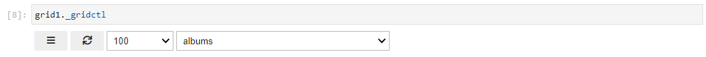
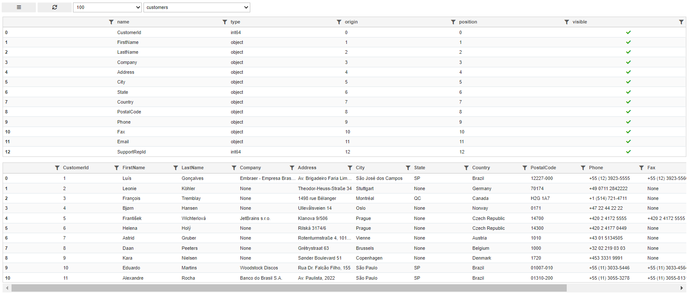

## User Interface with database scan enabled

### Setup

Libraries

```python
import sqlgrid
from sqlgrid.sqlData import sqlData
import ipywidgets as widgets
```

Database connection string

```python
databasePath = "sqlite:///./chinook.db"
```

Grid options

```python
grid_options = {
    # SlickGrid options
    'fullWidthRows': False,
    'syncColumnCellResize': True,
    'forceFitColumns': True,
    'defaultColumnWidth': 150,
    'rowHeight': 28,
    'enableColumnReorder': True,
    'enableTextSelectionOnCells': True,
    'editable': True,
    'autoEdit': False,
    'explicitInitialization': True,
    'enableCellNavigation': True,

    # Qgrid options
    'maxVisibleRows': 10,
    'minVisibleRows': 8,
    'sortable': True,
    'filterable': True,
    'highlightSelectedCell': True,
    'highlightSelectedRow': True
}
```

Output Widget (debug information for sqldata proxy)

```python
out = widgets.Output(layout=widgets.Layout(border='1px solid black'))
```

Database proxy object

```python
sql1 = sqlData(path=databasePath, out=out)
```

Grid database Browser

```python
grid1 = sqlgrid.gridctl(sql1, grid_options=grid_options, tableScan=True )
```

### **"Initial"** User Interface

The ```python grid1._gridctl``` object display the status line with four widgets left to right:

* The triple bar button
* The reload button
* The "data table width" dropdown
* The "database table" dropdown



To select a table, click on the corresponding dropdown and select a new item. If you want to see the first table, you need to select another one and then go back to the first one.
Then the "New Table Select" user Interface shows-up

### **"New Table Selected"** User Interface

Two grids are showing-up below the Initial user interface

* 1<sup>st</sup> grid is the table column definition a.k.a the "column" grid
* 2<sup>nd</sup> grid the first rows of the selected table with at most the 1st 25 columns displayed a.k.a the "data" grid



#### Show/Hide the "column" grid

Use the triple bar button:

* if "column" grid is diplayed, it get hidden
* else it get displayed

#### Show/Hide columns in the "data" grid

The "column" grid is controlling the "data" grid. The user can show/hide columns editing the visible field of any column: double click in the corresponding cell. Then click on the check box. When the check box is set, the colomn is diplayed else it is hidden.
Initially, the first 25 column are displayed

#### Change column order

To change the column order, for a selected column, click and hold the left mouse button and then drag the column heading to its new location, drop it there.

The position column of the "column grid" is adjusted accordingly.

#### Change the "data" grid width

Using the 1<sup>st</sup> dropdown, the user can select the "data" grid horizontal width.